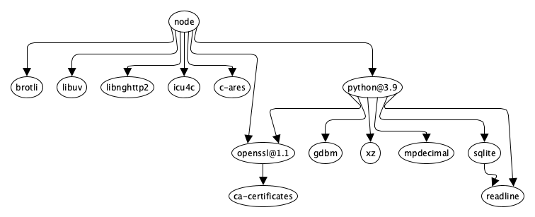
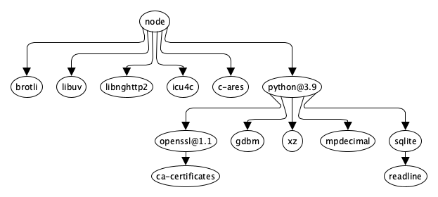

**Attention:** This repository has been renamed from `brew-graph` to `homebrew-graph` to adhere to the Homebrew naming conventions of [tap repositories][3].
Please update your local clones or forks (for consistency only, GitHub makes sure everything still works for you):

    git remote set-url origin https://github.com/martido/homebrew-graph

# brew-graph

1. [Installation](#installation)
2. [Usage](#usage)
3. [Requirements](#requirements)
4. [Transitive Reduction](#transitive-reduction)
5. [Upstream Dependencies](#upstream-dependencies)
6. [Known Issues](#known-issues)

`brew-graph` is a Ruby script that creates a dependency graph of Homebrew formulae. The currently supported output options are *DOT* and *GraphML*.

If you would like to know more about [Untangling Your Homebrew Dependencies][2], check out the blog post by Jonathan Palardy.

## Installation

Tapping this repo is the only installation step required! There is no need for a separate `brew install` step.

    brew tap martido/homebrew-graph
    
**Note:** If you already have the brew-graph formula installed from [the old tap repository][4], uninstall it first:

    brew uninstall brew-graph
    brew untap martido/homebrew-brew-graph

## Usage

Type `brew graph --help`.

    brew graph [options] formula1 formula2 ... | --installed | --all
    
    Create a dependency graph of Homebrew formulae.
    
    Options:
    
     -h, --help            Print this help message.
     -f, --format FORMAT   Specify FORMAT of graph (dot, graphml). Default: dot
     -o, --output FILE     Write output to FILE instead of stdout     
     --highlight-leaves    Highlight formulae that are not dependencies of another
                           installed formula. Default: false
     --highlight-outdated  Highlight outdated formulae. Default: false
     --include-casks       Include casks in the graph. Default: false
     --reduce              Apply transitive reduction to graph. Default: false
     --installed           Create graph for installed Homebrew formulae
     --all                 Create graph for all Homebrew formulae
    
    Examples:
    
    brew graph --installed
     Create a dependency graph of installed formulae and
     print it in DOT format to stdout.
    
    brew graph -f graphml --installed
     Same as before, but output GraphML markup.
    
    brew graph graphviz python
     Create a dependency graph of 'graphviz' and 'python' and
     print it in DOT format to stdout.
    
    brew graph -f graphml -o deps.graphml graphviz python
     Same as before, but output GraphML markup to a file named 'deps.graphml'.

## Requirements
You can use Graphviz to visualize DOT graphs.

    brew install graphviz
    brew graph --installed | dot -Tpng -ograph.png
    open graph.png

You can also use different Graphviz layouts, such as `fdp`. Simply replace `dot` with `fdp`:

    brew graph --installed | fdp -Tpng -ograph.png

You can use the [yEd][1] graph editor to visualize GraphML markup. The created markup uses yFiles's extensions to GraphML and heavily relies on defaults to keep the output reasonably small. It contains no layout information because yEd already provides an exhaustive set of algorithms.

## Transitive Reduction

The `--reduce` option applies a [transitive reduction][5] to the dependency graph.

Let's take Node.js as an example. This is the dependency graph:

`openssl@1.1` is a dependency of both `node` and `python@3.9` which `node` itself depends on. Similarly, `readline` is both a depedency of `python@3.9` and `sqlite`.

Transitive reduction simplifies the graph by removing direct edges in favor of transitive dependencies:

Contributed by [Nakilon][6].

## Upstream Dependencies

`brew-graph` only shows you the downstream dependencies of your installed formulae or arbitrary formulae arguments. If you would like to know which of your installed formulae depend on a given formula, you can use something like the following:  

    brew deps -1 --installed | grep ':.*FORMULA' | awk -F':' '{print $1}'

## Known Issues

There's an issue with Homebrew that dependencies are not listed correctly with `brew deps` if they are too outdated. This is described in the brew-graph issue [#13][7] and is also mentioned in [this Homebrew discussion thread][8]. So far, I've managed to resolve the issue everytime by upgrading dependencies with `brew upgrade`.

[1]: http://www.yworks.com/en/products_yed_about.html
[2]: http://blog.jpalardy.com/posts/untangling-your-homebrew-dependencies
[3]: https://docs.brew.sh/How-to-Create-and-Maintain-a-Tap
[4]: https://github.com/martido/homebrew-brew-graph
[5]: https://en.wikipedia.org/wiki/Transitive_reduction
[6]: https://github.com/Nakilon
[7]: https://github.com/martido/homebrew-graph/issues/13
[8]: https://github.com/Homebrew/discussions/discussions/1574
